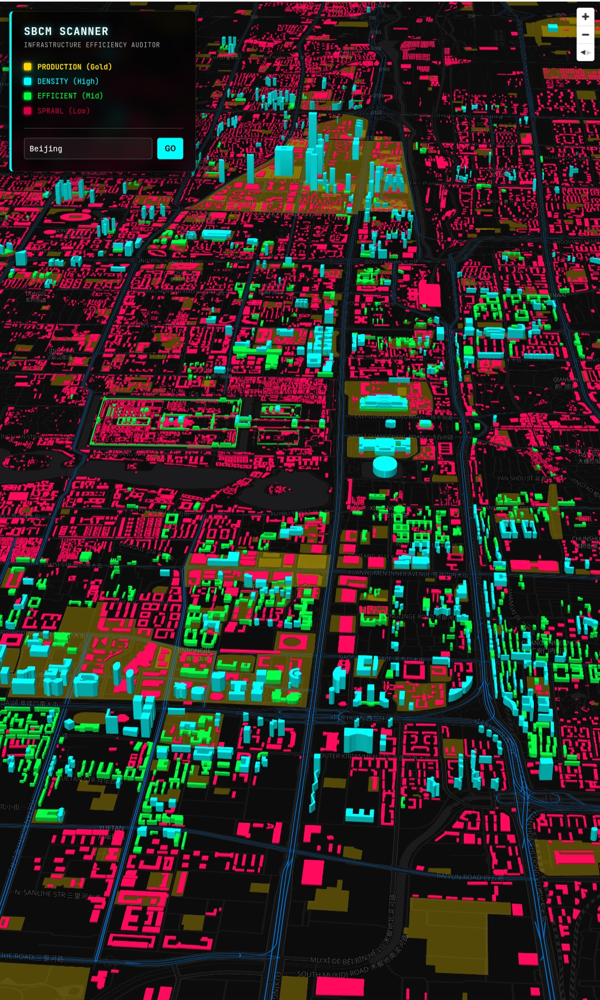
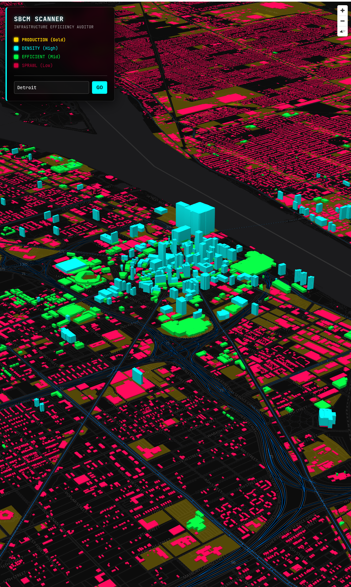
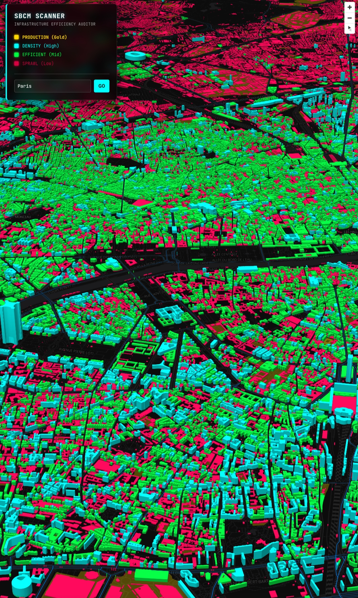

# 🌏 SBCM GLOBAL SCANNER
**3D Volumetric Efficiency Auditor.**

[]()
[](https://openfreemap.org/)
[](https://maplibre.org/)
[](LICENSE)

> **"On a flat map (2D), a city's 'Earning Power' remains invisible."**
>
> The fiscal collapse of local governments is caused by the imbalance between the "horizontal diffusion of infrastructure (Sprawl)" and the "vertical density of buildings (Revenue)."
>
> This tool is an **Administrative Forensics System** that visualizes the balance between a city's **"Volume"** and **"Maintenance Cost"** by converting global open data (Vector Tiles) into 3D in real-time.

---

## 📱 Demo

**👉 [Launch Global Scanner](https://sbcm-alliance.github.io/SBCM-Global-Scanner/)**
*(Works on PC / Smartphone Browsers)*

| Demo (Kashiwa City) | Beijing| Detroit | Paris| 
| :---: |  :---: |  :---: |  :---: | 
|  |  |  |  |

---

## 📐 The Logic (SBCM Field Theory)

Based on **SBCM Theory Part 4 (Field Theory)**, this system analyzes the city not as a surface area, but as a **"Field of Volume and Density."**

### 1. Revenue Visualization (Building Height)
We estimate the "Tax Revenue Potential (Profitability)" per unit of land area based on building height and color-code it accordingly.

| Color | Height | Status | Meaning |
| :--- | :--- | :--- | :--- |
| <span style="color:#00ffff">■</span> **CYAN** | **> 30m** | **HIGH (Excellent)** | **High Density.** High number of residents/tenants per infrastructure unit cost. These are the "Wealth Pumps" generating surplus. |
| <span style="color:#00ff41">■</span> **GREEN** | **> 10m** | **MID (Efficient)** | **Medium Density.** Buildings with 3+ floors. Sustainable density for an urban environment. |
| <span style="color:#ff0055">■</span> **RED** | **< 10m** | **LOW (Sprawl)** | **Low Density.** 2-story houses or less. A "Red Zone" where tax revenue often fails to cover infrastructure maintenance costs. |

### 2. Cost Visualization (Infrastructure Arteries)
<span style="color:#0088ff">**― BLUE LINE**</span>
Major roads (Highways, National/Prefectural roads) are rendered as glowing blue lines. This represents the **"Network of Fixed Costs"** that the administration must maintain indefinitely.

**The Verdict:**
Is the "Blue Line (Cost)" supported by enough "Cyan/Green Boxes (Revenue)"?
Or is it surrounded only by "Red Boxes"?
This ratio determines the remaining lifespan of the city.

---

## 🛠️ Features

### 1. Global Scope (OpenFreeMap)
We have switched the data source from the Japan-specific PLATEAU to the globally compatible **OpenFreeMap (OSM Vector Tiles)**.
This allows us to audit every city on Earth—from the backstreets of Tokyo to the skyscrapers of New York, to rural towns in Africa—using the **same standardized criteria**.

### 2. Layer Injection Technology
The system does not rely on pre-designed map styles (Style JSON). instead, the program forcibly **injects the "Audit 3D Layer"** into the map system.
This ensures that any location with data is reliably converted to 3D for visualization.

### 3. Serverless & High Performance
Powered by **MapLibre GL JS**, the system renders high-speed graphics within the browser using the device's GPU.
By avoiding heavy 3D models (gltf) and performing "Extrusion" processing on vector data on-the-fly, we achieve incredible lightness and speed.

---

## 🚀 Usage

### For Users
No installation required. Just access the URL.
Enter a city name (e.g., `Kashiwa`, `Manhattan`, `Paris`, `Detroit`) in the search box and press **GO**.

### For Developers (Local Run)
```bash
# Clone repository
git clone https://github.com/SBCM-Alliance/SBCM-Global-Scanner.git

# Run via Python simple server (to avoid CORS issues)
cd SBCM-Global-Scanner
python3 -m http.server

# Open http://localhost:8000
```

---

## ⚠️ Data Attribution

- Map Data: © [OpenStreetMap contributors](https://www.openstreetmap.org/copyright)
- Vector Tiles: [OpenFreeMap](https://openfreemap.org/)
- Rendering: MapLibre GL JS

---
<p align="center">
  <small>© 2025 SBCM Alliance. Powered by <b>Administrative Hydraulics</b>.</small>
</p>
